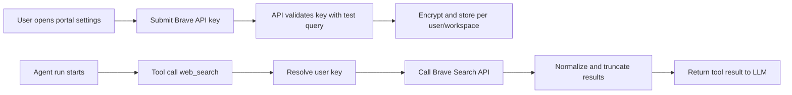

# Web Search API Key Handoff Strategy

## Goal

Enable web search tool usage in agents by:

1. Letting each user provide their own Brave Search API key
2. Storing keys securely per user per workspace
3. Resolving the key at tool runtime from the executing user context
4. Returning clean, citation-friendly search summaries for the LLM

This avoids a shared global key, improves accountability, and keeps spend ownership with the user who enables the feature.

---

## Current Problem

The built-in tool type `web_search` is exposed to the model, but `executeWebSearch()` in `apps/api/src/app/agent/agent-tool.service.ts` is still a placeholder. The model learns this tool is not useful and tends not to call it.

---

## Recommended Model

Use a per-user key handoff pattern, similar in spirit to per-user MCP credentials:

- User enters Brave API key in portal settings
- Backend validates and encrypts key
- Key is stored as a user-scoped secret
- Agent tool execution fetches and decrypts the key for the current user
- Backend calls Brave Search API and returns compact structured results

### Why per-user over workspace-global

1. Better cost ownership and limits per person
2. No accidental key sharing across workspace members
3. Easier auditing and incident response
4. Supports mixed configurations (some users enable, others do not)

---

## Architecture



---

## Data Model

Prefer a generic user secret table so future providers can reuse it.

```prisma
model UserExternalSecret {
  id             String   @id @default(uuid())
  userId         String   @map("user_id")
  workspaceId    String   @map("workspace_id")
  provider       String   // "brave-search"
  secretType     String   // "api_key"
  secretEncrypted String  @map("secret_encrypted")
  status         String   @default("active") // active | invalid | revoked
  lastValidatedAt DateTime? @map("last_validated_at") @db.Timestamptz()
  lastUsedAt     DateTime? @map("last_used_at") @db.Timestamptz()
  createdAt      DateTime @default(now()) @db.Timestamptz()
  updatedAt      DateTime @updatedAt @db.Timestamptz()

  @@unique([userId, workspaceId, provider, secretType])
  @@index([userId, workspaceId])
  @@index([workspaceId, provider])
  @@map("user_external_secrets")
}
```

If you want minimal scope first, create a dedicated table only for Brave keys and migrate to generic later.

---

## API Contract

### 1) Save / Update Key

- `PUT /api/v1/integrations/web-search/brave/key`
- Auth required
- Body:

```json
{
  "workspaceId": "...",
  "apiKey": "BSA..."
}
```

Behavior:

1. Validate format (non-empty, min length)
2. Perform live validation call to Brave endpoint with a tiny query
3. Encrypt and upsert secret
4. Return masked key metadata only

### 2) Get Connection Status

- `GET /api/v1/integrations/web-search/brave/status?workspaceId=...`

Response example:

```json
{
  "connected": true,
  "provider": "brave-search",
  "lastValidatedAt": "2026-06-11T08:15:00.000Z",
  "maskedKey": "BSA****9K2"
}
```

### 3) Delete Key

- `DELETE /api/v1/integrations/web-search/brave/key?workspaceId=...`

Behavior:

- Soft revoke (`status=revoked`) or hard delete

---

## Backend Implementation Plan

### A. Secret Service

Create `UserExternalSecretService` with methods:

1. `upsertBraveApiKey(userId, workspaceId, apiKey)`
2. `getBraveApiKey(userId, workspaceId)`
3. `getBraveStatus(userId, workspaceId)`
4. `deleteBraveApiKey(userId, workspaceId)`

Encryption:

- Reuse AES-256-GCM approach already used for MCP credentials
- Key source: `MCP_ENCRYPTION_KEY` (or rename to broader `APP_SECRETS_ENCRYPTION_KEY` later)

### B. Brave Client

Create `BraveSearchService`:

1. `validateKey(apiKey)`
2. `search(apiKey, query, opts)`

Request pattern (example):

- `GET https://api.search.brave.com/res/v1/web/search?q=...&count=5`
- Header: `X-Subscription-Token: <apiKey>`

### C. Tool Wiring

In `apps/api/src/app/agent/agent-tool.service.ts`:

1. Inject `UserExternalSecretService` and `BraveSearchService`
2. Change `executeWebSearch` signature to include execution context:
   - `executeWebSearch(args, userId, workspaceId?)`
3. In `executeTool`, pass `userId` and `agent.workspaceId` to `executeWebSearch`
4. Return clear error when key is missing:
   - "Web search is not configured for this user. Please connect Brave API key in Integrations settings."

### D. Response Normalization

Return concise text optimized for LLM consumption:

```text
Top web results for "latest pgvector release":
1. PostgreSQL Extension Docs
   URL: https://...
   Snippet: ...
2. GitHub Release Notes
   URL: https://...
   Snippet: ...
```

Rules:

1. Max 5 results
2. Strip tracking params from URLs
3. Truncate snippets to around 240 chars
4. Include source hostname for trust
5. If no results, return explicit "no relevant results"

---

## Frontend Handoff Flow (Portal / AI Agents Panel)

1. Add "Web Search" integration card in settings panel
2. User pastes Brave key and clicks Connect
3. Show immediate validation state: Connected or Invalid Key
4. Show masked key and last validated timestamp
5. Add Disconnect action
6. In Agent Builder, show warning badge when `web_search` selected but key not connected for current user

UX copy for missing key at runtime:

- "This agent can use Web Search, but your Brave API key is not connected yet. Add it in Settings -> Integrations -> Web Search."

---

## Security and Compliance

1. Never return raw API key after save
2. Encrypt at rest with AES-256-GCM
3. Redact key from logs and error traces
4. Rate limit key validation endpoint
5. Add abuse guardrails on search endpoint usage per user/day
6. Store audit events: key_added, key_removed, search_invoked

---

## Observability

Add structured logs and metrics:

1. `web_search_calls_total` (by workspaceId, userId, success/failure)
2. `web_search_latency_ms`
3. `web_search_no_key_total`
4. `web_search_provider_errors_total` (401, 429, 5xx)

Dashboard should quickly answer:

- Are users configured?
- Are calls succeeding?
- Is Brave quota/rate limit causing failures?

---

## Rollout Plan

### Phase 1 (MVP)

1. Per-user key save/status/delete endpoints
2. Real Brave API call in `executeWebSearch`
3. Basic UI in portal settings
4. Basic runtime error messaging

### Phase 2

1. Usage counters and quotas per user
2. Better result ranking/cleaning
3. Caching recent queries for 1-5 minutes
4. Optional fallback provider support (Serper)

### Phase 3

1. Generic multi-provider web search abstraction
2. Provider routing policy (cost, latency, availability)
3. Workspace admin policy controls (allowed providers)

---

## Acceptance Criteria

1. User can connect Brave key in portal and see connected status
2. `web_search` tool returns real external results for configured users
3. Non-configured users get actionable error message
4. API keys are encrypted at rest and masked in responses
5. Logs contain no plaintext secrets
6. LLM begins calling `web_search` for fresh-information queries

---

## Open Decisions

1. Should key scope be user+workspace (recommended) or user-global?
2. Soft revoke vs hard delete policy for key removal?
3. Do we enforce provider allowlist by workspace plan/tier?
4. Should we allow one shared workspace key as fallback for users without personal key?

Recommended defaults:

- Scope: user+workspace
- Removal: soft revoke
- Plan gating: no (MVP)
- Shared fallback: no (clear ownership and billing)
